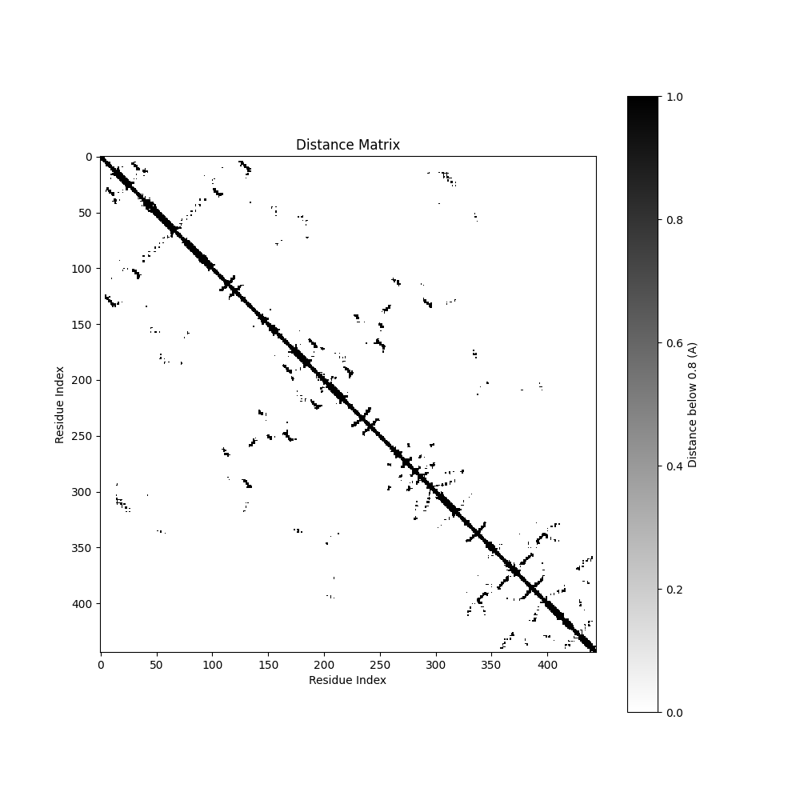
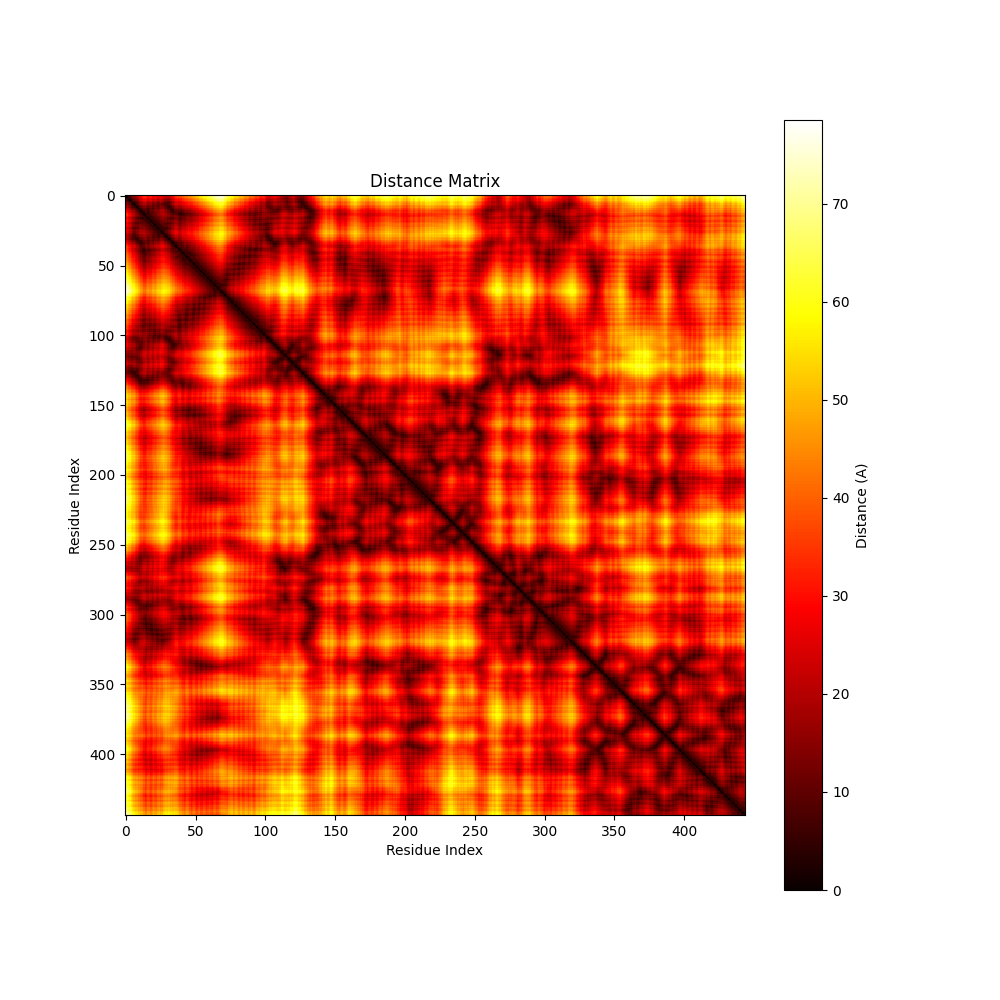

# Biopython Protein Contact Map Visualization

This script generates a distance matrix and a contact map from a given PDB file using Biopython. The distance matrix shows the distances between the alpha carbon atoms (CA) of amino acid residues, and the contact map highlights the residues that are within a certain distance threshold.

## Requirements

- biopython==1.84
- contourpy==1.3.1
- cycler==0.12.1
- fonttools==4.55.0
- kiwisolver==1.4.7
- matplotlib==3.9.2
- numpy==2.1.3
- packaging==24.2
- pillow==11.0.0
- pyparsing==3.2.0
- python-dateutil==2.9.0.
- six==1.16.0

## Installation

```
pip install -r requirements.txt
```

## Usage

```
py get_plot.py -f <PDB_FILE_PATH>
```

### Example Result

```
py ge_plot.py -f 4ywo.pdb
```



